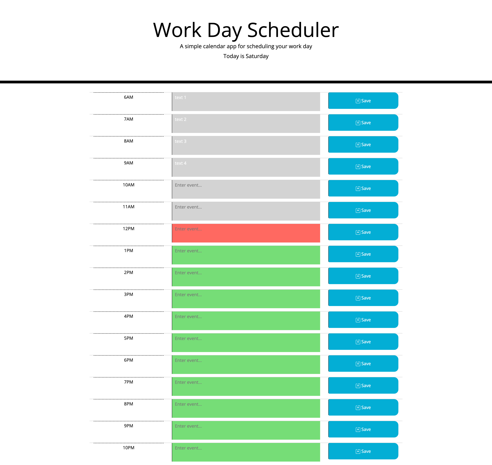

# Day-Planner / Work Day Scheduler

Simple calendar application that allows a user to save events for each hour of the day by modifying starter code. This app will run in the browser and feature dynamically updated HTML and CSS powered by jQuery.

You'll need to use the [Moment.js](https://momentjs.com/) library to work with date and time. Be sure to read the documentation carefully and concentrate on using Moment.js in the browser.

## User Story

```md
AS AN employee with a busy schedule
I WANT to add important events to a daily planner
SO THAT I can manage my time effectively
```

## Acceptance Criteria

```md
GIVEN I am using a daily planner to create a schedule
WHEN I open the planner
THEN the current day is displayed at the top of the calendar
WHEN I scroll down
THEN I am presented with timeblocks for standard business hours
WHEN I view the timeblocks for that day
THEN each timeblock is color coded to indicate whether it is in the past, present, or future
WHEN I click into a timeblock
THEN I can enter an event
WHEN I click the save button for that timeblock
THEN the text for that event is saved in local storage
WHEN I refresh the page
THEN the saved events persist
```

The following animation demonstrates the application functionality:


## Description

After reviewing the CSS, I was happy to see that I could use existing classes to structure my HTML rows, and eventually add existing classes to rows to reflect the time status (past,present, future).

First, I created two demo HTML rows to get the styling down. After they looked correct I created the necessary Javascript variables to reflect my HTML elements.

Next, aftering reviewing documentation for moment.js, I was able to set up a proper API pull and grab the current day and the current hour of the user's local time.
Using the 24-hour format moment.js return value, I was able to conditionally add classes to the rows to color them correctly based on their time status.

Next, I set up an event listener on the row save button to locally store the input of that row's respective text area input. I then pulled from this local storage and displayed in the event field - which properly stayed in local storage upon page reload.

Finally, after one row was properly styled and locally storing its event input, I duplicated the rows and adjusted so they are independently setting/getting local storage.

## Deployment Details

Repo: [Day Planner Homework - Alex Geis Github](https://github.com/alexgeis/Day-Planner)

GitHub Pages URL: [Day Planner](https://alexgeis.github.io/Day-Planner/)

Screenshot: 
